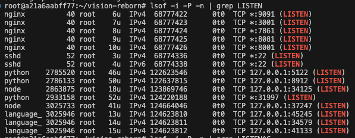

# Full instructions for setup


### Hardware
Setups tested for mining so far:

| Name  | CUDA Version | Ubuntu Version | Python Version | Works |
|-------|--------------|----------------|----------------|-------|
| A100** | 11.8  | 22.04 | 3.10.12 |  ✅ |
| RTX 4090 | 11.8  | 22.04 | 3.10.12 | ✅ |
| A600 | 12.0   | 22.04 | 3.10.12 |✅ |
| A40 | 12.0   | 22.04 | 3.10.12 | ✅ |
| L40 | 12.0   | 22.04 | 3.10.12 | ✅ |
| A100 SXM | 11.8  | 22.04 | 3.10.12 |  ❌ |

Note: That's not to say you can't use other GPU's!

** I would recommend the A100 for the easiest life going forward.
As the requirements increase, the A100 will be the most cost effective and simple to use for validators.
## Setup steps

### Clone the repo
```bash
git clone https://github.com/namoray/vision
cd vision
```


### Install system dependencies

If you are in a container such as runpod, run these:

```bash
### Install pm2 & jq
apt update && apt upgrade -y
apt install nodejs npm -y
npm i -g pm2
apt-get install -y jq

### Install vim so you can edit the config easily
apt-get update
apt-get install vim

### Install lsof so you can see ports not in use
apt-get install lsof
```

If you are on a bare metal machine (e.g. Vast) where you require `sudo`, use the following:
```bash
### Install pm2 & jq
sudo apt update && apt upgrade -y
sudo apt install nodejs npm -y
sudo npm i -g pm2
sudo apt-get install -y jq

### Install vim so you can edit the config easily
sudo apt-get update
sudo apt-get install vim

### Install lsof so you can see ports not in use
sudo apt-get install lsof
```


### Install python dependencies
Make sure you have installed the correct python version, and then follow these steps:

```bash
### Install the local python environment
pip install --upgrade pip
pip install -e .
pip install -r git_requirements.txt
```

If for some reason that doesn't work, you may need to use `pip3`;
```bash
### Install the local python environment
pip3 install --upgrade pip
pip3 install -e .
pip3 install -r git_requirements.txt
```


### Download the necessary models
Simple step this one - note it may take a while if you have poor bandwidth (not recommended)

```bash
./get_models.sh
```

## Bandwidth selling validator
This is the less simple but more exciting of the two! Now you get to sell your bandwidth to whoever you want, with a very simple to use CLI!

The steps are similar to synthetic only validators:

**If you are renting a virtualized GPU e.g. on runpod:**

Before you make the config, run the command
```bash
lsof -i -P -n | grep LISTEN
```

This shows you all the ports currently in use. When you come to choose a `CHECKING_SERVER_ADDRESS` and `SAFETY_CHECKER_SERVER_ADDRESS`, make sure the ports you choose aren't already in use.

Example output:


This shows that ports 9091, 3001, .., 34579, 41133 etc, are currently in use, so pick address that don't include these.

Typically the default values I provide will work :)


#### Creating the config

```bash
vision create-config
```

Make sure to use a port which is exposed to the outside world for API_SERVER_PORT.

Note: if you're using a provider such as runpod, there are instructions here https://docs.runpod.io/docs/expose-ports#:~:text=If%20your%20pod%20supports%20a,address%20to%20access%20your%20service. Follow the "Symmetrical port mapping" step :)

#### Starting the server

### With autoupdates
```bash
pm2 start --name run_validator_auto_update "python run_validator_auto_update.py"
```

### Without auto updates
```bash
./validation/run_all_servers.sh
```

This uses the config defined in the `config.yaml`.

### Creating the database

```bash
curl -fsSL -o /usr/local/bin/dbmate https://github.com/amacneil/dbmate/releases/latest/download/dbmate-linux-amd64
chmod +x /usr/local/bin/dbmate

dbmate --url "sqlite:validator_database.db" up
```

#### Managing access

To manage access to the your api server and sell access to anyone you like, using the vision-cli is the easiest way.


```bash
vision --help
```

Shows all the commands and should give self explanatory instructions.

You can also do

```bash
vision some-command --help
```

To get more info about that command!

# Examples

For example:

```bash
vision create-key 10 60 test
```
Creates a test key with a balance of 10 (which corresponds to 10 images), a rate limit of 60 requests per minute = 1/s, and a name 'test'.

Now you can do:
```bash
vision list-keys
```
To see the API key. Give / sell this access to whoever you want to have access to your API server to query the network organically - these will be scored too!
